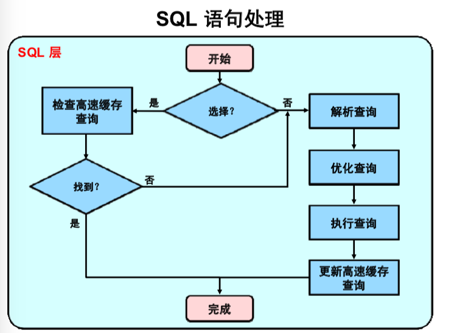

# MySQL数据库简述、安装与密码修改  
#### 作者:coresu  
#### 时间:2019-11-15   


### 目录  

* [MySQL安装方式分类](#MySQL安装方式分类)  
* [安装准备（tar过程为例）](#安装准备（tar过程为例）)
* [正式安装MySQL](#正式安装MySQL)   
* [启动MySQL服务器准备](#启动MySQL服务器准备)  
* [正式启动MySQL服务器](#正式启动MySQL服务器)  
* [“重要的”MySQL服务器（mysqld）](#“重要的”MySQL服务器（mysqld）)  
* [修改MySQL数据库密码](#如何修改MySQL数据库密码)

### MySQL安装方式分类  
MySQL安装两种方式:  

```
└── MySQL
    ├── 二进制
    │   ├── RPM
    │   └── tar文件 
    └── 源代码
```

* 源代码方式，升级麻烦。 
    - 优点：可以自己定制某些功能。
    - 缺点：缺点是升级的时候新版本文件是要覆盖源文件

* tar压缩包式安装，本质上也是rpm包，同时升级简单。  
    - 优点：是MySQL会帮我们定制好一些rpm文件，升级可理解为在同一个目录中两个不同版本的文件夹，实现多版本共存。  
    - 缺点：不可定制特有功能，可玩性差。

* 【注意】在安装过程中平台要匹配，64位兼容32位操作系统。64位MySQL数据库不能安装在32位操作系统上。   
    - 这个位数指的是CPU GPRs（General-Purpose Registers，通用寄存器）的数据宽度为64位，也就是说处理器一次可以运行64bit数据。
```
[root@chris ~]# uname -a
Linux chris 2.6.32-696.el6.x86_64 #1 SMP Tue Feb 21 00:53:17 EST 2017 x86_64 x86_64 x86_64 GNU/Linux
```
可以使用uname -a查看Linux操作系统版本。


### 安装准备（tar过程为例）  
将在MySQL压缩包在/soft/mysql目录下解压，没有可自行建立。并使用rpm -qpl命令查看如果数据包安装将安装在什么位置。
```
[root@chris soft]# pwd
/soft

[root@chris soft]# mkdir mysql

[root@chris soft]# tar -xvf MySQL-5.6.39-1.el6.x86_64.rpm-bundle.tar -C /soft/mysql
MySQL-embedded-5.6.39-1.el6.x86_64.rpm
MySQL-test-5.6.39-1.el6.x86_64.rpm
MySQL-shared-5.6.39-1.el6.x86_64.rpm
MySQL-server-5.6.39-1.el6.x86_64.rpm
MySQL-devel-5.6.39-1.el6.x86_64.rpm
MySQL-client-5.6.39-1.el6.x86_64.rpm
MySQL-shared-compat-5.6.39-1.el6.x86_64.rpm

[root@chris mysql]# pwd
/soft/mysql

# 列出MySQL-server-5.6.39-1.el6.x86_64.rpm包的安装路径
[root@chris mysql]# rpm -qpl MySQL-server-5.6.39-1.el6.x86_64.rpm 
warning: MySQL-server-5.6.39-1.el6.x86_64.rpm: Header V3 DSA/SHA1 Signature, key ID 5072e1f5: NOKEY
/etc/init.d/mysql
/etc/logrotate.d/mysql
/etc/my.cnf
/etc/my.cnf.d
/usr/bin/innochecksum
/usr/bin/my_print_defaults
/usr/bin/myisam_ftdump
```

##### 有的Linux服务器本身可能已经安装完了MySQL数据库的ipm包，最好删掉！

```
[root@chris mysql]# rpm -qa|grep mysql
mysql-libs-5.1.73-8.el6_8.x86_64
```
直接删除可能会失败，以无依赖的方式强制删除。
```
[root@chris mysql]# rpm -qa|grep mysql
mysql-libs-5.1.73-8.el6_8.x86_64


[root@chris mysql]# rpm -e mysql-libs-5.1.73-8.el6_8.x86_64
error: Failed dependencies:
    libmysqlclient.so.16()(64bit) is needed by (installed) postfix-2:2.6.6-8.el6.x86_64
    libmysqlclient.so.16(libmysqlclient_16)(64bit) is needed by (installed) postfix-2:2.6.6-8.el6.x86_64
    mysql-libs is needed by (installed) postfix-2:2.6.6-8.el6.x86_64

[root@chris mysql]# rpm -e mysql-libs-5.1.73-8.el6_8.x86_64 -f --nodeps
```

### 正式安装MySQL   
以rpm包的形式安装server服务端。
```
[root@chris mysql]# rpm -ivh MySQL-server-5.6.39-1.el6.x86_64.rpm 

warning: MySQL-server-5.6.39-1.el6.x86_64.rpm: Header V3 DSA/SHA1 Signature, key ID 5072e1f5: NOKEY
Preparing...                ########################################### [100%]
   1:MySQL-server           ########################################### [100%]
warning: user mysql does not exist - using root
......
......
New default config file was created as /usr/my.cnf and
will be used by default by the server when you start it.
You may edit this file to change server settings
```

以rpm包的形式安装client端。
```
[root@chris mysql]# cd /soft/mysql/
[root@chris mysql]# rpm -ivh MySQL-client-5.6.39-1.el6.x86_64.rpm 
warning: MySQL-client-5.6.39-1.el6.x86_64.rpm: Header V3 DSA/SHA1 Signature, key ID 5072e1f5: NOKEY
Preparing...                ########################################### [100%]
   1:MySQL-client           ########################################### [100%]
```


如图/var/lib/mysql为MySQL的服务目录，可查看到已经创建好的test（空库）、mysql、performance_schema数据库。
```
[root@chris mysql]# cd /var/lib/mysql
[root@chris mysql]# ll
total 110612
-rw-r--r--. 1 root  root       111 Nov 12 19:52 RPM_UPGRADE_HISTORY
-rw-r--r--. 1 mysql mysql      111 Nov 12 19:52 RPM_UPGRADE_MARKER-LAST
-rw-rw----. 1 mysql mysql 50331648 Nov 12 19:52 ib_logfile0
-rw-rw----. 1 mysql mysql 50331648 Nov 12 19:52 ib_logfile1
-rw-rw----. 1 mysql mysql 12582912 Nov 12 19:52 ibdata1
drwx--x--x. 2 mysql mysql     4096 Nov 12 19:52 mysql
drwx------. 2 mysql mysql     4096 Nov 12 19:52 performance_schema
drwxr-xr-x. 2 mysql mysql     4096 Nov 12 19:52 test
```


查看Linux下MySQL的命令存在什么地方
```
[root@chris bin]# ll /usr/bin/mysql*
-rwxr-xr-x. 1 root root 9881386 Dec  9  2017 /usr/bin/mysql
-rwxr-xr-x. 1 root root 8919053 Dec  9  2017 /usr/bin/mysql_config_editor
-rwxr-xr-x. 1 root root    4299 Dec  9  2017 /usr/bin/
......
......
```


### 启动MySQL服务器准备 
以Linux服务的形式启动mysqld   
【注意】这里的mysql服务其实是mysqld服务。   
```
[root@chris ~]# cd /etc/init.d
[root@chris init.d]# ll
total 420
-rwxr-xr-x. 1 root root  2188 Jan 13  2017 NetworkManager
-rwxr-xr-x. 1 root root  1287 Dec 18  2016 abrt-ccpp
......
......
-rwxr-xr-x. 1 root root 10500 Dec  9  2017 mysql
......
```

/etc/my.cnf文件类似Oracle中的pfile或spfile，mysqld在启动的时候会读取此配置文件，用户可以使用配置文件来定制数据库的运行。
```
[root@chris mysql]# ll /usr/my.cnf 
-rw-r--r--. 1 root root 943 Nov 12 19:52 /usr/my.cnf
```


### 正式启动MySQL服务器  
以Linux服务的形式启动MySQL数据库服务器。
```
[root@chris ~]# cd /var/lib/mysql
[root@chris mysql]# ll
total 110612
-rw-r--r--. 1 root  root       111 Nov 12 19:52 RPM_UPGRADE_HISTORY
-rw-r--r--. 1 mysql mysql      111 Nov 12 19:52 RPM_UPGRADE_MARKER-LAST
-rw-rw----. 1 mysql mysql 50331648 Nov 12 19:52 ib_logfile0
-rw-rw----. 1 mysql mysql 50331648 Nov 12 19:52 ib_logfile1
-rw-rw----. 1 mysql mysql 12582912 Nov 12 19:52 ibdata1
drwx--x--x. 2 mysql mysql     4096 Nov 12 19:52 mysql
drwx------. 2 mysql mysql     4096 Nov 12 19:52 performance_schema
drwxr-xr-x. 2 mysql mysql     4096 Nov 12 19:52 test
[root@chris mysql]# service mysql start
Starting MySQL.Logging to '/var/lib/mysql/chris.err'.
.                                                          [  OK  ]
```

抓取进程，查看MySQL服务器是否真的启动。

```
[root@chris mysql]# pd -ef |grep mysqld
-bash: pd: command not found
[root@chris mysql]# ps -ef |grep mysqld
root     30551     1  0 23:09 pts/1    00:00:00 /bin/sh /usr/bin/mysqld_safe --datadir=/var/lib/mysql --pid-file=/var/lib/mysql/chris.pid
mysql    30647 30551  0 23:09 pts/1    00:00:00 /usr/sbin/mysqld --basedir=/usr --datadir=/var/lib/mysql --plugin-dir=/usr/lib64/mysql/plugin --user=mysql --log-error=chris.err --pid-file=/var/lib/mysql/chris.pid
root     30954 22383  0 23:11 pts/1    00:00:00 grep mysqld
```
##### 注意： 

* 在chris.pid文件中存放mysqld的进程号，有时后服务器起不来可能是，进程号无法写入此文件。
* mysqld进程关闭，此文件消失。
```
[root@chris mysql]# more /var/lib/mysql/chris.pid
30647
[root@chris mysql]# 
[root@chris mysql]# 
[root@chris mysql]# service mysql stop
Shutting down MySQL..                                      [  OK  ]
[root@chris mysql]# ps -ef |grep mysqld
root     31215 22383  0 23:12 pts/1    00:00:00 grep mysqld
[root@chris mysql]# more /var/lib/mysql/chris.pid
/var/lib/mysql/chris.pid: No such file or directory
```


* mysqld_safe并不是二进制文件而是shell文件，通过mysqls_safe进而启动MySQL服务。
* mysqld_multi也是shell文件可以启动多个MySQL服务。

```
[root@chris mysql]# ll /usr/bin/mysqld_*
-rwxr-xr-x. 1 root root 26518 Dec  9  2017 /usr/bin/mysqld_multi
-rwxr-xr-x. 1 root root 27288 Dec  9  2017 /usr/bin/mysqld_safe
```


### “重要的”MySQL服务器（mysqld）   


mysqld称为MySQL服务器，是多线程组成的一个单进程程序，支持并发连接、支持事务和非事务操作。

服务器的三个层次：  

* 连接层
    - Linux 远程使用TCP/IP，本地使用UNIX套接字
    - Windows 在本地使用共享内存和命名管道，远程也是用TCP/IP
* SQL层（类似于Oracle中shared pool）
    - 解析 解析执行计划
    - 授权
    - 优化器
    - 查询执行计划
    - 查询高速缓存
    - 查询日志  MySQL中的日志有六种，比Oracle记录的更细。慢查询、binlog等等...，默认情况下是不开启的，使用参数控制值日状态开关。


    - ##### SQL语句处理过程

 


* 存储层

> ##### 引擎描述(表格)  

| 类型 | 阐述 |
| :--- | :--- |
| 磁盘 |innoDB支持事务，多版本一致性读（默认存储引擎）、MyISAM不支持事务，处理速度更快，会出现脏读现象。 |
| 内存 | memory内存引擎，无法永久化存储啊 |
| 网络 |  NDB将数据存储在网络上 |

MySQL在表级做了很多优化，引擎、字符集都坐在了表级别，例如：不同的表可以使用不同的引擎。  


### 修改MySQL数据库密码

##### 1.查看初始密码  
```
[root@chris ~]# cd
[root@chris ~]# pwd
/root
[root@chris ~]# ll .mysql_secret 
-rw-------. 1 root root 104 Nov 12 19:52 .mysql_secret
[root@chris ~]# cat .mysql_secret 
# The random password set for the root user at Tue Nov 12 19:52:08 2019 (local time): 7EScin5RtIRMNIfE

```

##### 2.初次登录MySQL数据库，以mysql -u root -p格式


```
[root@chris mysql]# service mysql status
MySQL running (31853)                                      [  OK  ]
[root@chris mysql]# 
[root@chris mysql]# cd
[root@chris ~]# cat .mysql_secret 
# The random password set for the root user at Tue Nov 12 19:52:08 2019 (local time): 7EScin5RtIRMNIfE

[root@chris ~]# mysql -u root -p 
Enter password: 
Welcome to the MySQL monitor.  Commands end with ; or \g.
Your MySQL connection id is 3
Server version: 5.6.39

Copyright (c) 2000, 2018, Oracle and/or its affiliates. All rights reserved.

Oracle is a registered trademark of Oracle Corporation and/or its
affiliates. Other names may be trademarks of their respective
owners.

Type 'help;' or '\h' for help. Type '\c' to clear the current input statement.

mysql> 

```

##### 3.mysql_secure_installation服务修改root用户密码
```
[root@chris ~]# mysql_secure_installation
perl: warning: Setting locale failed.
......
......
Enter current password for root (enter for none): 
OK, successfully used password, moving on...
......
......
Change the root password? [Y/n] y
......
......
Remove anonymous users? [Y/n] n
......
......
Disallow root login remotely? [Y/n] y
......
......
Remove test database and access to it? [Y/n] n
......
......
Reload privilege tables now? [Y/n] y
......
......
Cleaning up...
```


