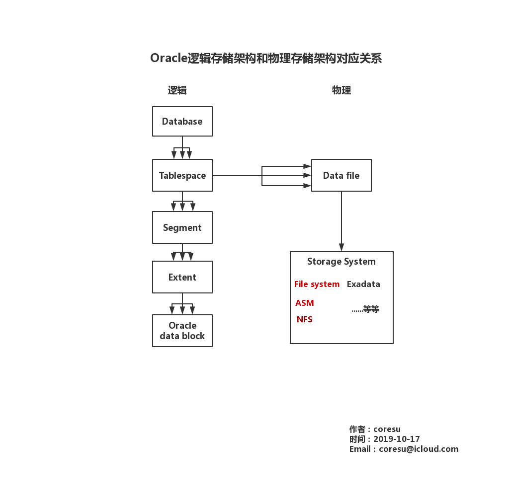

# 【体系】--Oracle中Insert的运作流程    
### 作者:coresu    
### 时间:2019:10:17  

Oracle中Insert大致经历如下三个阶段：  

* shared pool阶段  
* buffer pool阶段  
* redo、undo阶段
  
#### shared pool阶段  

#### SQL语句执行六阶段：open-->parse-->bind-->execute-->fetch-->close
&nbsp;&nbsp;&nbsp;&nbsp;&nbsp;&nbsp;&nbsp;&nbsp;SQL语句在SGA的shared_pool的library cache中，处于parse阶段首先生成执行计划。

#### buffer pool阶段  
&nbsp;&nbsp;&nbsp;&nbsp;&nbsp;&nbsp;&nbsp;拿到执行计划的SQL语句，进入下一个阶段，在DB BUFFER CACHE中申请buffer（内存空间）  
DBWR在下一个周期被触发，或由checkpoint触发时，将被修改的Oracle block写入硬盘文件   
插入到对应表空间下，对应的数据文件中。

#### redo、undo阶段
> 在此阶段产生REDO信息、和undo记录
> > UNDO记录（UNDO产生REDO信息）   
> > 索引段REDO信息，在UNDO里面记录相关数据行号。
在COMMIT时，redo log buffer中增加的SCN被LGWR写入redo log file中，   
懒写（与LGWR相比较慢）的DBWR进程工作，将缓存中的数据写入磁盘的脏数据块写入
至此事务结束，Commit完成，回显用户完成插入操作。

&nbsp;&nbsp;&nbsp;&nbsp;&nbsp;&nbsp;&nbsp;&nbsp;undo阶段详细说明，[参阅update篇](./[体系]--update语句在Oracle实例中的运作过程.md)

#### Oracle的存储架构   
insert语句插入数据如下逻辑存储架构的Oracle block中。
物理存储架构视情况而定，不同服务器使用不同物理架构。

