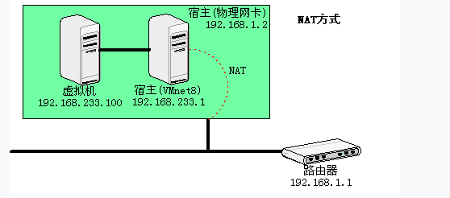
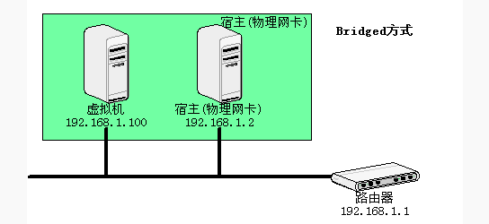
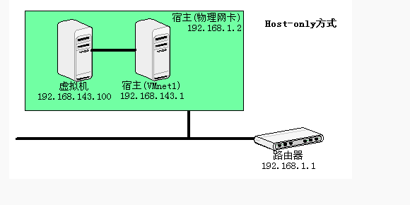

# 虚拟机中的三种链接方式
### 作者:coresu  
### 时间:2019-10-20  

## Bridged Adapter（网桥模式）

网桥模式就是通过主机网卡建立一座桥梁，作为单独的一台主机连入外网，如主机没有任何区别。  
因此，他被虚拟机分配一个网段允许同一网段内其他主机连接，及连接其他主机。

| 虚拟机与主机的关系 | 虚拟机与同网段其他主机的关系 | 虚拟机与虚拟机的关系 |  
| :---------: | :---: | :---: |
| 彼此可以相互PING通。 | 彼此可以相互PING通。 | 彼此可以相互PING通。   |

## Internal（内网模式）

内网模式就是虚拟机与外网完全断开，只实现虚拟机于虚拟机之间的内部网络模式。

| 虚拟机与主机的关系 | 虚拟机与同网段其他主机的关系 | 虚拟机与虚拟机的关系 |  
| :---: | :---: | :---: |
| 因非同一网络，不能相互访问 | 因非同一网络，不能相互访问 | 同一网段前提下可以相互访问 |
 

## Host-only Adapter（主机模式）

主机模式比较复杂，可以看做之前两种连接方式的结合，可理解成在主机中模拟一张专供虚拟机使用的网卡，所有虚拟机均连接此网卡，我们可以通过设置这张网卡来实现上网及其他很多功能，比如（网卡共享、网卡桥接等）。

| 虚拟机与主机的关系 | 虚拟机与同网段其他主机的关系 | 虚拟机与虚拟机的关系 |  
| :---: | :---: | :---: |
| 默认不能相互访问，需设置网卡共享或桥接可实现互访 | 默认不能相互访问，需设置网卡共享或桥接可实现互访 | 因属同一网段，故可以相互访问 |

